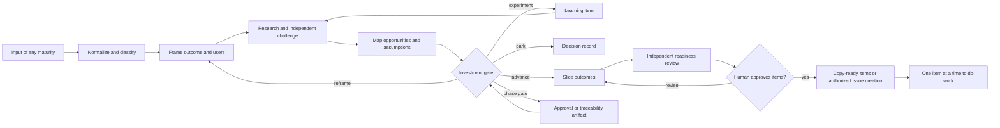

# Product shaping lifecycle

## Control loop

## Agent topology

The parent owns context, synthesis, methodology choice, gates, and user interaction. `research-product` gathers evidence; `challenge-product` seeks disconfirming evidence and alternatives; `review-work-items` checks the final set. Specialists are read-only, cannot spawn agents, and return advice rather than decisions.

Run research and challenge in parallel only when their questions are independent. Never parallelize competing conversations with the human. The human owns product intent, investment decisions, external research approval, item publication, and the choice to begin delivery.

## Evidence rules

Use this hierarchy without confusing authority with relevance:

1. observed user behavior and direct research;
2. product analytics, support data, and operational evidence;
3. experiments with predefined thresholds;
4. domain and market sources;
5. stakeholder statements;
6. agent inference.

For every material claim record `source`, `date`, `population/context`, `confidence`, and `implication`. Mark absence of evidence. Separate facts, interpretations, assumptions, and decisions. A polished PRD can still contain unvalidated assumptions; a rough idea can sometimes rest on strong evidence.

## Exit criteria

Shaping is complete only when the human has approved a disposition and, for `advance`, every selected item passes the work-item contract. Completion means ready for deeper repository-specific grilling by `do-work`, not implementation approval.
