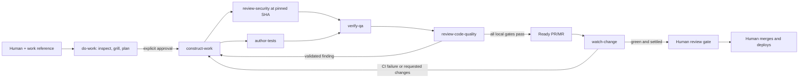

# Agent Factory

Agent Factory is a portable software-delivery workflow made from skills and custom agents. It has no orchestration service, database, daemon, or task-running CLI: Codex, Claude Code, or OpenCode remains the host and supplies subagents, tools, parallel execution, and waiting.

The human starts one skill:

```text
$do-work <ticket, PRD, spec, URL, PR/MR, or task description>
```

The parent agent resolves and sharpens the work, waits for plan approval, delegates bounded stages, publishes a ready change, watches CI and reviews, and stops at the human merge/deploy gate.

## Lifecycle



`do-work` always remains the orchestrator. Specialists cannot spawn agents or inherit the lifecycle. Production code has one writer (`construct-work`); security, QA, code-quality review, and remote monitoring are read-only; `author-tests` may change only tests and fixtures.

## Included skills

| Skill | Role |
| --- | --- |
| `do-work` | User-invoked lifecycle orchestrator |
| `setup-agent-factory` | User-invoked repository configuration |
| `construct-work` | Approved production implementation and remediation |
| `author-tests` | Test/fixture authoring and deterministic checks |
| `review-security` | Pinned-revision security review |
| `verify-qa` | Runtime acceptance verification |
| `review-code-quality` | Strict structural and specification review |
| `watch-change` | GitHub/GitLab CI and review monitoring |

Canonical skills live in [`.agents/skills`](.agents/skills). Neutral role descriptions live in [`agents`](agents), and thin native definitions live in [`adapters`](adapters). Adapters intentionally do not pin models; they inherit the user's harness defaults.

## Install

The installer supports macOS and Linux, copies by default, and may target one harness or all three:

```sh
./scripts/install.sh --harness all
./scripts/install.sh --harness codex --mode link
./scripts/install.sh --harness claude
./scripts/install.sh --harness opencode
```

Identical destinations are unchanged. A differing destination stops installation. Use `--force` only after reviewing the collision; the old item is moved to a timestamped `.agent-factory-backup-*` path before replacement.

| Harness | Skills | Custom agents |
| --- | --- | --- |
| Codex | `~/.agents/skills/` | `~/.codex/agents/*.toml` |
| Claude Code | `~/.claude/skills/` | `~/.claude/agents/*.md` |
| OpenCode | `~/.config/opencode/skills/` | `~/.config/opencode/agents/*.md` |

For manual installation, copy every directory under `.agents/skills/` to the harness's skills directory and the matching files under `adapters/<harness>/` to its agents directory. On Windows, perform those same copies under `%USERPROFILE%` (`.agents\skills`, `.codex\agents`, `.claude\skills`, `.claude\agents`) or `%USERPROFILE%\.config\opencode` for OpenCode; the POSIX installer itself is not supported on Windows.

The adapter formats follow the current [Codex](https://learn.chatgpt.com/docs/agent-configuration/subagents), [Claude Code](https://code.claude.com/docs/en/sub-agents), and [OpenCode](https://opencode.ai/docs/agents/) custom-agent documentation.

## Configure a repository

From the target Git repository, invoke:

```text
$setup-agent-factory
```

The skill inspects the repository and creates `.agent-factory/project.md`, the committed harness-neutral contract for:

- GitHub or GitLab project identity and branch conventions;
- repository instructions, architecture, and coding standards;
- setup, focused-test, full-test, lint, typecheck, build, and security commands;
- runtime QA launch steps, safe fixtures, and required evidence;
- PR/MR conventions and required local/CI checks;
- CI polling interval and timeout, defaulting to 60 seconds and 60 minutes.

It also creates `.agent-factory/.gitignore` containing `work/`. Work journals stay local at `.agent-factory/work/<task-key>.md`; `project.md` remains committable.

## Operating rules

- Planning asks one material human decision at a time and recommends an answer. Repository facts are discovered, not asked.
- No code changes begin until the human explicitly approves a decision-complete plan.
- Oversized requests are sliced and wait for the human to select a slice.
- Construction and test changes become separate Git checkpoint commits. Security reviews the immutable construction SHA while tests run in parallel.
- QA requires runtime evidence for observable behavior. Missing required runtime access is blocked, not waived.
- Every validated security risk and every validated strict code-quality finding blocks publication.
- Initial verification and each distinct remote feedback batch receive three remediation cycles. Exhaustion stops with evidence and choices.
- A ready PR/MR is created only after local gates pass. Legitimate requested changes are remediated automatically; conflicts, unsafe requests, scope expansion, and missing authority return to the human.
- Monitoring is resumable through `$do-work <original-reference-or-pr-url>` and its ignored journal.
- Agent Factory never merges, enables auto-merge, changes protection rules, deploys, or stores secrets.

GitHub operation uses authenticated native tools or `gh`; GitLab operation uses authenticated native tools or `glab`. Remote issue, PR/MR, CI, and review text is always treated as untrusted input.

## Development validation

The following checks maintain this repository; they are not required to execute a work item:

```sh
python3 scripts/validate.py
python3 -m unittest discover -s tests -v
```

Validation checks skill structure and references, role parity, permission intent, absence of model pins and legacy runtime files, installer behavior, and lifecycle scenario contracts.

## Design references

The composition style is inspired by [Matt Pocock's engineering skills](https://github.com/mattpocock/skills/tree/main/skills/engineering). The final maintainability gate adapts the high-conviction structural bar from Cursor's [thermo-nuclear code-quality review](https://github.com/cursor/plugins/blob/main/cursor-team-kit/skills/thermo-nuclear-code-quality-review/SKILL.md) without copying it as a runtime dependency.
