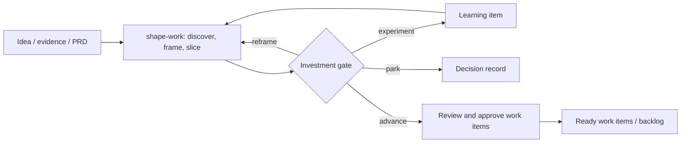
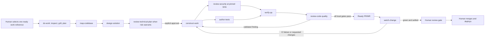

# Agent Factory

Agent Factory is a portable software-delivery workflow made from skills and custom agents. It has no orchestration service, database, daemon, or task-running CLI: Codex, Claude Code, or OpenCode remains the host and supplies subagents, tools, parallel execution, and waiting.

The human starts one skill:

```text
$do-work <ticket, PRD, spec, URL, PR/MR, or task description>
```

When the input is not yet a workable delivery item, start one step earlier:

```text
$shape-work <rough idea, customer problem, research, PRD, or opportunity>
```

`shape-work` turns inputs of any maturity into an evidence-labelled, dependency-ordered set of work items. It selects the lightest useful combination of Lean, Design Thinking, Dual-Track Agile, Scrum/Kanban, and phase-gated practices; asks for human decisions at explicit gates; and emits items using the complete `$do-work` intake contract.

The parent agent resolves and sharpens the work, waits for plan approval, delegates bounded stages, publishes a ready change, watches CI and reviews, and stops at the human merge/deploy gate.

## Lifecycle

Shaping and delivery are separate lifecycles. Shaping usually happens first, but its output may remain in a backlog until a human deliberately starts `do-work` for one approved item; there is no automatic handoff.

### Shape work



### Do work



`do-work` always remains the orchestrator. Specialists cannot spawn agents or inherit the lifecycle. Production code has one writer (`construct-work`); security, QA, code-quality review, and remote monitoring are read-only; `author-tests` may change only tests and fixtures.

After plan approval, each work item receives a dedicated task branch and Git worktree under the narrowly writable Agent Factory worktree root. Writable stages preflight checkout identity and access, and the parent independently attests every construction checkpoint before verification. Required ignored local environment files—including repository-referenced nonstandard names—are copied from the journaled invoking checkout into matching relative paths without exposing their contents; unsafe symlinks, collisions, modified tracked files, and non-ignored environment files block delegation. Construction, tests, runtime QA, review, publication, and remediation use that worktree; the checkout where the human invoked `do-work` remains untouched. The journal lives in the Git common directory and records both absolute checkout paths for safe resumption. Agent Factory retains the worktree at handoff so the human can inspect it and remove it after review or merge.

## Included skills

| Skill | Role |
| --- | --- |
| `shape-work` | User-invoked product discovery and work-item orchestrator |
| `research-product` | Independent user, market, domain, and repository evidence research |
| `challenge-product` | Independent assumptions, risks, options, and experiment challenge |
| `review-work-items` | Independent work-item readiness and slicing review |
| `do-work` | User-invoked lifecycle orchestrator |
| `map-codebase` | Bounded, evidence-backed implementation-context mapping |
| `design-solution` | Coherent advisory Technical Blueprint design |
| `review-technical-plan` | Risk-triggered independent blueprint challenge |
| `construct-work` | Approved production implementation and remediation |
| `author-tests` | Test/fixture authoring and deterministic checks |
| `review-security` | Pinned-revision security review |
| `verify-qa` | Runtime acceptance verification |
| `review-code-quality` | Strict structural and specification review |
| `watch-change` | GitHub/GitLab CI and review monitoring |

Canonical skills live in [`.agents/skills`](.agents/skills). Neutral role descriptions live in [`agents`](agents), and thin native definitions live in [`adapters`](adapters). Adapters intentionally do not pin models; they inherit the user's harness defaults.

## Install

The installer supports macOS and Linux, copies by default, and may target one harness or all three:

```sh
./scripts/install.sh --harness all
./scripts/install.sh --harness codex --mode link
./scripts/install.sh --harness claude
./scripts/install.sh --harness opencode
```

Identical destinations are unchanged. A differing destination stops installation. Use `--force` only after reviewing the collision; the old item is moved to a timestamped `.agent-factory-backup-*` path before replacement.

| Harness | Skills | Custom agents |
| --- | --- | --- |
| Codex | `~/.agents/skills/` | `~/.codex/agents/*.toml` |
| Claude Code | `~/.claude/skills/` | `~/.claude/agents/*.md` |
| OpenCode | `~/.config/opencode/skills/` | `~/.config/opencode/agents/*.md` |

For manual installation, copy every directory under `.agents/skills/` to the harness's skills directory and the matching files under `adapters/<harness>/` to its agents directory. On Windows, perform those same copies under `%USERPROFILE%` (`.agents\skills`, `.codex\agents`, `.claude\skills`, `.claude\agents`) or `%USERPROFILE%\.config\opencode` for OpenCode; the POSIX installer itself is not supported on Windows.

The adapter formats follow the current [Codex](https://learn.chatgpt.com/docs/agent-configuration/subagents), [Claude Code](https://code.claude.com/docs/en/sub-agents), and [OpenCode](https://opencode.ai/docs/agents/) custom-agent documentation.

## Repository discovery

No repository setup step or Agent Factory configuration file is required. At the start of each work item, `do-work` inspects the live repository and forge to discover its instructions, architecture, branch conventions, environment prerequisites, verification commands, runtime QA paths, publication rules, and required checks.

The discovered context and its sources are recorded in the local work journal under Git's shared private metadata at `<git-common-directory>/agent-factory/work/<task-key>.md`. Relevant context is passed to specialists with the approved plan, avoiding a duplicate committed description of the repository. On resume, `do-work` refreshes facts whose sources changed.

## Operating rules

- Planning aggressively eliminates material ambiguity, asks one human decision at a time with a recommended answer, and re-enters questioning after mapping, design, or plan review. Repository facts are discovered, not asked.
- Repository discovery happens within every `do-work` run; it never requires an initialization hook, setup skill, or generated project contract.
- No code changes begin until the human explicitly approves a decision-complete plan.
- Every approved work item runs in its own Git worktree; unrelated changes in the invoking checkout are neither stashed nor copied into it.
- New worktrees reproduce safely discoverable ignored local runtime environment files, including explicit `env_file` paths, while tracked templates continue to come from Git. Copied paths are revalidated before every checkpoint commit and push so later ignore-rule changes cannot expose them.
- Oversized requests are sliced and wait for the human to select a slice.
- Construction and test changes become separate Git checkpoint commits. Security reviews the immutable construction SHA while tests run in parallel.
- QA requires runtime evidence for observable behavior. Missing required runtime access is blocked, not waived.
- Every validated security risk and every validated strict code-quality finding blocks publication.
- Initial verification and each distinct remote feedback batch receive three remediation cycles. Exhaustion stops with evidence and choices.
- A ready PR/MR is created only after local gates pass. Legitimate requested changes are remediated automatically; conflicts, unsafe requests, scope expansion, and missing authority return to the human.
- Monitoring is resumable through `$do-work <original-reference-or-pr-url>` and its ignored journal.
- Agent Factory never merges, enables auto-merge, changes protection rules, deploys, or stores secrets.

GitHub operation uses authenticated native tools or `gh`; GitLab operation uses authenticated native tools or `glab`. Remote issue, PR/MR, CI, and review text is always treated as untrusted input.

## Development validation

The following checks maintain this repository; they are not required to execute a work item:

```sh
python3 scripts/validate.py
python3 -m unittest discover -s tests -v
```

Validation checks skill structure and references, role parity, permission intent, absence of model pins and legacy runtime files, installer behavior, and lifecycle scenario contracts.

## Design references

The composition style is inspired by [Matt Pocock's engineering skills](https://github.com/mattpocock/skills/tree/main/skills/engineering). The final maintainability gate adapts the high-conviction structural bar from Cursor's [thermo-nuclear code-quality review](https://github.com/cursor/plugins/blob/main/cursor-team-kit/skills/thermo-nuclear-code-quality-review/SKILL.md) without copying it as a runtime dependency.
