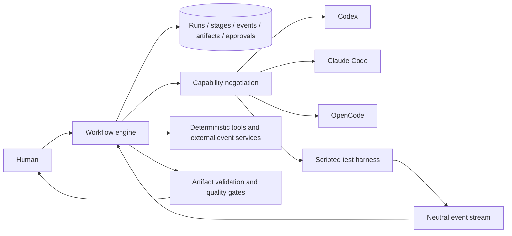

# Agent Factory

Agent Factory is a provider- and harness-neutral orchestration core for an agent-controlled software-development lifecycle. The factory owns durable workflow decisions; replaceable harness adapters execute one bounded, permissioned agent task and return typed events and artifacts.

## Architecture



- **Factory**: state, routing, dependencies, exclusive workspace writers, retries, invalidation, approvals, audit history, and escalation.
- **Harness**: a Codex, Claude Code, OpenCode, or other execution surface. It materializes native configuration, invokes/cancels work, and translates events. It is not the model provider.
- **Provider/model profile**: resolves a logical profile to a harness/provider model at deployment time; canonical agents contain no model names.
- **Agent**: reasons inside one bounded task and returns one typed artifact.
- **Skill**: focused reusable instructions stored under `.agents/skills/<name>/SKILL.md`.
- **Tool**: an explicit deterministic operation with structured arguments and an allowlist.
- **Workflow/stage**: a versioned dependency graph and one schedulable unit within it.
- **Event**: normalized, append-only execution evidence.
- **Artifact**: validated, lineage-bearing stage output bound to a source revision.

The executable lifecycle covers planning, approval, isolated construction, test authoring, deterministic checks, parallel security/QA/code review, remediation, pull request and CI/review monitoring, final approval, expected-head merge, deployment observation, smoke verification, rollback, and terminal reporting.

## Repository structure

| Path                        | Purpose                                                             |
| --------------------------- | ------------------------------------------------------------------- |
| `src/domain.ts`             | Provider-neutral schemas and types                                  |
| `src/workflow.ts`           | Dependency scheduler, approval, remediation, retries, writer lock   |
| `src/harness.ts`            | Adapter contract, negotiation, scripted adapter, external scaffolds |
| `src/infrastructure.ts`     | Isolated Git worktrees and allowlisted command execution            |
| `src/github.ts`             | PR publication, CI/review monitor, GitHub CLI provider              |
| `src/release.ts`            | Final approval, merge, deployment, smoke checks, rollback           |
| `src/observability.ts`      | Correlated structured logs, metrics, and secret redaction           |
| `src/artifacts.ts`          | Artifact validation and explicit invalidation rules                 |
| `src/repositories.ts`       | Persistence interfaces and in-memory implementation                 |
| `.agent-factory/agents/`    | Canonical agent definitions                                         |
| `.agent-factory/workflows/` | Canonical workflow definitions                                      |
| `.agents/skills/`           | Canonical, harness-neutral skills                                   |
| `examples/`                 | Runnable input                                                      |

## Operate the workflow

Requires Node.js 22+ and pnpm.

```bash
pnpm install
pnpm agent-factory doctor
pnpm agent-factory work "Implement the requested change" --json
pnpm agent-factory approve <plan-approval-id> --actor local-human --json
pnpm agent-factory inspect <run-id>
pnpm validate
```

The default local backend uses an isolated Git worktree, a deterministic scripted agent adapter, real allowlisted validation commands, and transactional SQLite at `.agent-factory/factory.db`. It pauses durably at human gates; the demonstration intentionally fails its first review, remediates, invalidates old evidence, and reaches `locally-verified`. Pass `--database <path>` to use another database. See [Operator guide](docs/operator-guide.md) for PR, CI, final approval, deployment, recovery, and scripting details.

## Creating definitions

### Agent

Add a validated YAML document to `.agent-factory/agents`. Select logical skill IDs, least-privilege tools and permissions, a logical model profile, bounded turns/time, and an output schema. Planning and reviewers are read-only; only construction and testing roles receive scoped write access. The engine rejects simultaneous writable stages.

### Skill

Create `.agents/skills/<name>/SKILL.md` with YAML frontmatter containing `name`, `version`, `description`, `triggers`, `inputs`, and `outputs`, followed by focused instructions. Optional `scripts/` and `references/` live beside it. Paths are resolved beneath the canonical root and traversal is rejected.

### Workflow

Add a versioned YAML workflow with stages, dependencies, input/output artifact types, permissions, and required harness capabilities. Dependencies must complete before scheduling. Approval stages pause durably. A quality gate routes findings back to construction—not to a review agent with write access—and bounded policies prevent feedback loops.

## Adding a harness

Implement `HarnessAdapter`: declare capabilities, map canonical definitions to disposable native files, stream normalized `AgentEvent`s, and cancel runs. Scheduling calls capability negotiation first; absent guarantees raise `HarnessCompatibilityError` rather than silently degrading. External scaffolds currently materialize an initial agent file and truthfully throw `UnsupportedHarnessOperationError` for run/cancel.

Canonical files in `.agent-factory/agents` and `.agents/skills` are the source of truth. `.codex/agents`, `.claude/{agents,skills}`, and `.opencode/agents` are generated, ignored, disposable build artifacts and must never be edited as canonical configuration. Credentials are neither schemas nor prompt inputs; deployment adapters must obtain them out of band and redact tool output.

## Security model

All definitions, prompts, repository content, tool output, and review comments are untrusted. Zod validates boundaries; definition loading confines real paths; permissions deny filesystem/network access by default; commands are represented as executable plus arguments and require allowlisting; artifacts and reviews are revision-bound. A production tool service must additionally sandbox processes, redact secrets before persistence, and authorize every requested operation against the task envelope.

## Known limitations

- SQLite and file locks target one local operator host; distributed scheduling and leases are not implemented.
- `ProcessHarnessAdapter` is the production-capable local NDJSON harness. Codex, Claude Code, and OpenCode adapters truthfully expose configuration/capability contracts but still reject invocation until a deployment supplies their process/API bridge.
- GitHub integration uses authenticated `git` and `gh`; monitoring is restart-safe one-shot polling intended for an external scheduler, not an always-on daemon.
- The initial deployment provider runs explicitly configured local commands and stores state locally. Cloud-specific deployment discovery requires another `DeploymentProvider` implementation.
- Automatic rollback occurs only when an allowlisted rollback command is configured; otherwise failure escalates to a human.

Release evidence and the supported surface are recorded in the [release checklist](docs/release-checklist.md), [compatibility matrix](docs/compatibility-matrix.md), and [end-to-end evidence](docs/e2e-evidence.md).
